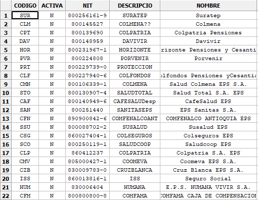

.. /////// 2018/09/03 - Hernan Dario Cano [dcanohdev@gmail.com]
.. // docs/classes/widgets/controls/grid.rst
.. //  Class Grid reference
.. //   (c) 2018 Hernan Dario Cano

.. _ClassGrid:

Grid
========

::

   lide.widgets.controls.grid 1.0

.. note::

  Grid is derived from Control_ class.

The Grid control is used for displaying and editing tabular data. They provide a rich set of features 
for display, editing, and interacting with a variety of data sources.

The general look of a control at runtime is demonstrated in the following picture:

----------------------------------------------------------------------------------------------------

Constructor
***********

Control class has a single constructor:

.. code-block:: lua

 Grid:new { 
    object Parent, string Name, 
    number PosX, number PosY, 
    number SelectMode = GRID_SELMODE_ROWS,
 }

Arguments
^^^^^^^^^

These arguments are received by class constructor.

============  ===========================================================================================
  Argument     Description
============  ===========================================================================================
 Name          The control name
 Parent        The control parent
 PosX          Position related to X
 PosY          Position related to Y
 SelectMode    ``GRID_SELMODE_ROWS`` ``GRID_SELMODE_CELLS`` ``GRID_SELMODE_COLUMNS``
============  ===========================================================================================

------------------------------------------------------------------------------------------------------

Events
******

The following events are emitted by this class:

============================  =========================================================================
  Event name                    Description
============================  =========================================================================
 Grid.onSelectCell             When the selected date was changed.
============================  =========================================================================

----------------------------------------------------------------------------------------------------

Inherited Methods
*****************

These methods are inherited from its super classes:

=====================  =============================================================================
  Class Method          Description
=====================  =============================================================================
 Object:getName_	       Returns control's name.
 Object:setName_	       Sets the control name.
 Widget:getParent_	     Returns control's parent.
 Widget:setParent_	     Sets the control parent.
 Widget:getPosX_	       Returns control's position related to X.
 Widget:setPosX_	       Sets the control position related to X.
 Widget:getPosY_	       Returns control's position related to Y.
 Widget:setPosY_	       Sets the control position related to Y.
 Widget:getEnabled_      Returns true if is enabled.
 Widget:setEnabled_      Set control enabled or disabled.
 Widget:getVisible_      Returns the control visibility.
 Widget:setVisible_      Returns the control visibility.
 Widget:getBind_         Returns a reference to the C++ control.
=====================  =============================================================================

----------------------------------------------------------------------------------------------------

Class Methods
*************

These methods are defined by this class.

------------------------------------------------------------------------------------------------------

Grid:getTable
^^^^^^^^^^^^^
   
  Returns a base pointer to the current table object.

=========  =========================================================================================
 nil_       Grid:enableYearChange( bool_ Enable = true )
=========  =========================================================================================

----------------------------------------------------------------------------------------------------

Grid:setTable
^^^^^^^^^^^^^
   
  Passes a pointer to a custom grid table to be used by the grid. This should be called after the 
  grid constructor and before using the grid object. If takeOwnership is set to true then the table 
  will be deleted by the wxGrid destructor.

=========  =========================================================================================
 bool_      Grid:setTable( table_ grid_table, bool_ auto_size, bool_ takeOwnership, number_ selmode = ``GRID_SELMODE_CELLS`` )
=========  =========================================================================================

----------------------------------------------------------------------------------------------------

Grid:setDefaultCellFont
^^^^^^^^^^^^^^^^^^^^^^^
   
  Sets the default font to be used for grid cell text.

=========  =========================================================================================
 nil_       Grid:setDefaultCellFont( string_ sFontFamily, number_ nFontSize, string_ sFontFlags )
=========  =========================================================================================

----------------------------------------------------------------------------------------------------

Grid:setCellFont
^^^^^^^^^^^^^^^^
   
  Sets the font for text in the grid cell at the specified location.

=========  =========================================================================================
 nil_       Grid:setCellFont( number_ nRow, number_ nCol, string_ sFontFamily, number_ nFontSize, string_ sFontFlags )
=========  =========================================================================================

----------------------------------------------------------------------------------------------------

Grid:setDefaultCellAlignment
^^^^^^^^^^^^^^^^^^^^^^^^^^^^
   
  Sets the default horizontal and vertical alignment for grid cell text.

  Horizontal alignment should be one of ``ALIGN_LEFT``, ``ALIGN_CENTRE`` or ``ALIGN_RIGHT``.
  Vertical alignment should be one of ``ALIGN_TOP``, ``ALIGN_CENTRE`` or ``ALIGN_BOTTOM``.

=========  =========================================================================================
 nil_       Grid:setDefaultCellAlignment( number_ nHoriz, number_ nVert )
=========  =========================================================================================

----------------------------------------------------------------------------------------------------

Grid:setCellAlignment
^^^^^^^^^^^^^^^^^^^^^
   
  Sets the horizontal and vertical alignment for grid cell text at the specified location.

  Horizontal alignment should be one of ``ALIGN_LEFT``, ``ALIGN_CENTRE`` or ``ALIGN_RIGHT``.
  Vertical alignment should be one of ``ALIGN_TOP``, ``ALIGN_CENTRE`` or ``ALIGN_BOTTOM``.

=========  =========================================================================================
 nil_       Grid:setCellAlignment( number_ nRow, number_ nCol, number_ nHoriz, number_ nVert )
=========  =========================================================================================

----------------------------------------------------------------------------------------------------

Grid:getRowLabelSize
^^^^^^^^^^^^^^^^^^^^^
   
  Returns the current width of the row labels.

=========  =========================================================================================
 nil_       Grid:getRowLabelSize()
=========  =========================================================================================

----------------------------------------------------------------------------------------------------

Grid:getColLabelSize
^^^^^^^^^^^^^^^^^^^^^
   
  Returns the current height of the column labels.

=========  =========================================================================================
 nil_       Grid:getColLabelSize()
=========  =========================================================================================

----------------------------------------------------------------------------------------------------

Grid:setRowLabelSize
^^^^^^^^^^^^^^^^^^^^
   
  Sets the width of the row labels.

  If width equals ``GRID_AUTOSIZE`` then width is calculated automatically so that no label is 
  truncated. **Note that this could be slow for a large table. This flag is new since wxWidgets version 2.8.8.**

=========  =========================================================================================
 nil_       Grid:setRowLabelSize( number_ nWidth )
=========  =========================================================================================

----------------------------------------------------------------------------------------------------

Grid:setColLabelSize
^^^^^^^^^^^^^^^^^^^^
   
  Sets the height of the column labels.

  If width equals ``GRID_AUTOSIZE`` then width is calculated automatically so that no label is 
  truncated. **Note that this could be slow for a large table. This flag is new since wxWidgets version 2.8.8.**

=========  =========================================================================================
 nil_       Grid:setColLabelSize( number_ nHeight )
=========  =========================================================================================

----------------------------------------------------------------------------------------------------

Grid:getRowLabel
^^^^^^^^^^^^^^^^
   
  Returns the specified row label. The default grid table class provides numeric row labels. If you 
  are using a custom grid table you can override GridTable:getRowLabelValue to provide your own labels.

=========  =========================================================================================
 string_    Grid:getRowLabel( number_ nRow )
=========  =========================================================================================

----------------------------------------------------------------------------------------------------

Grid:getColLabel
^^^^^^^^^^^^^^^^
   
  Returns the specified column label. The default grid table class provides column labels of the 
  form A,B...Z,AA,AB...ZZ,AAA... If you are using a custom grid table you can override 
  GridTable:GetColLabelValue to provide your own labels.

=========  =========================================================================================
 string_    Grid:getRowLabel( number_ nRow )
=========  =========================================================================================

----------------------------------------------------------------------------------------------------

Grid:setRowLabel
^^^^^^^^^^^^^^^^
   
  Set the value for the given row label. If you are using a derived grid table you must override 
  GridTable:setRowLabel for this to have any effect.

=========  =========================================================================================
 nil_       Grid:setRowLabel( number_ nRow, string_ sText )
=========  =========================================================================================

----------------------------------------------------------------------------------------------------

Grid:setColLabel
^^^^^^^^^^^^^^^^
   
  Set the value for the given column label. If you are using a derived grid table you must override 
  GridTable:setColLabelValue for this to have any effect.

=========  =========================================================================================
 nil_       Grid:setColLabel( number_ nCol, string_ sText )
=========  =========================================================================================

----------------------------------------------------------------------------------------------------

Grid:autoSize
^^^^^^^^^^^^^
   
  Automatically sets the height and width of all rows and columns to fit their contents.

.. note::

  Grid sets up arrays to store individual row and column sizes when non-default sizes are used. 
  The memory requirements for this could become prohibitive if your grid is very large.

=========  =========================================================================================
 nil_       Grid:autoSize()
=========  =========================================================================================

----------------------------------------------------------------------------------------------------

Grid:autoSizeColumn
^^^^^^^^^^^^^^^^^^^
   
  Automatically sizes the column to fit its contents. If setAsMin is true the calculated width will 
  also be set as the minimal width for the column.

.. note::

  Grid sets up arrays to store individual row and column sizes when non-default sizes are used. 
  The memory requirements for this could become prohibitive if your grid is very large.

=========  =========================================================================================
 nil_       Grid:autoSizeColumn( number_ nCol, bool_ SetAsMin = true )
=========  =========================================================================================

----------------------------------------------------------------------------------------------------

Grid:autoSizeColumns
^^^^^^^^^^^^^^^^^^^^
   
  Automatically sizes all columns to fit their contents. If ``setAsMin`` is ``true`` the calculated 
  widths will also be set as the minimal widths for the columns.

.. note::

  Grid sets up arrays to store individual row and column sizes when non-default sizes are used. 
  The memory requirements for this could become prohibitive if your grid is very large.

=========  =========================================================================================
 nil_       Grid:autoSizeColumns( bool_ setAsMin = true )
=========  =========================================================================================

----------------------------------------------------------------------------------------------------

Grid:autoSizeRow
^^^^^^^^^^^^^^^^
   
  Automatically sizes the row to fit its contents. If ``setAsMin`` is ``true`` the calculated height 
  will also be set as the minimal height for the row.

.. note::

  Grid sets up arrays to store individual row and column sizes when non-default sizes are used. 
  The memory requirements for this could become prohibitive if your grid is very large.

=========  =========================================================================================
 nil_       Grid:autoSizeRow( number_ nRow, bool_ SetAsMin = true )
=========  =========================================================================================

----------------------------------------------------------------------------------------------------

Grid:autoSizeRows
^^^^^^^^^^^^^^^^^
   
  Automatically sizes all rows to fit their contents. If ``setAsMin`` is ``true`` the calculated height 
  will also be set as the minimal heights for the rows.

.. note::

  Grid sets up arrays to store individual row and column sizes when non-default sizes are used. 
  The memory requirements for this could become prohibitive if your grid is very large.

=========  =========================================================================================
 nil_       Grid:autoSizeRow( bool_ setAsMin = true )
=========  =========================================================================================

----------------------------------------------------------------------------------------------------

Grid:autoSizeColLabelSize
^^^^^^^^^^^^^^^^^^^^^^^^^
   
  Automatically adjusts width of the column to fit its label.

=========  =========================================================================================
 nil_       Grid:autoSizeColLabelSize( number_ nCol )
=========  =========================================================================================

----------------------------------------------------------------------------------------------------

Grid:autoSizeRowLabelSize
^^^^^^^^^^^^^^^^^^^^^^^^^
   
  Automatically adjusts height of the row to fit its label.

=========  =========================================================================================
 nil_       Grid:autoSizeRowLabelSize( number_ nRow )
=========  =========================================================================================

----------------------------------------------------------------------------------------------------

Grid:getColSize
^^^^^^^^^^^^^^^
   
  Returns the width of the specified column.

=========  =========================================================================================
 nil_       Grid:getColSize( number_ nCol )
=========  =========================================================================================

----------------------------------------------------------------------------------------------------

Grid:getRowSize
^^^^^^^^^^^^^^^
   
  Returns the height of the specified row.

=========  =========================================================================================
 nil_       Grid:getRowSize( number_ nRow )
=========  =========================================================================================

----------------------------------------------------------------------------------------------------

Grid:setRowSize
^^^^^^^^^^^^^^^
   
  Sets the height of the specified row.

.. note::

  See setColSize() for more information.

=========  =========================================================================================
 nil_       Grid:setRowSize( number_ nRow, number_ nHeight )
=========  =========================================================================================

----------------------------------------------------------------------------------------------------

Grid:setColSize
^^^^^^^^^^^^^^^
   
  Sets the width of the specified column.

  This function does not refresh the grid. If you are calling it outside of a BeginBatch / EndBatch 
  block you can use Grid:forceRefresh to see the changes.

  Automatically sizes the column to fit its contents. If setAsMin is true the calculated width will 
  also be set as the minimal width for the column.

.. note::

  Grid sets up arrays to store individual row and column sizes when non-default sizes are used. 
  The memory requirements for this could become prohibitive if your grid is very large.

=========  =========================================================================================
 nil_       Grid:setColSize( number_ nCol, number_ nWidth )
=========  =========================================================================================

----------------------------------------------------------------------------------------------------

Grid:getCellSize
^^^^^^^^^^^^^^^^
   
  Get the size of the cell in number of cells covered by it.

  For normal cells, the function fills both num_rows and num_cols with 1 and returns CellSpan_None. 
  For cells which span multiple cells, i.e. for which SetCellSize() had been called, the returned 
  values are the same ones as were passed to SetCellSize() call and the function return value is 
  CellSpan_Main.

  More unexpectedly, perhaps, the returned values may be negative for the cells which are inside a 
  span covered by a cell occupying multiple rows or columns. They correspond to the offset of the 
  main cell of the span from the cell passed to this functions and the function returns 
  CellSpan_Inside value to indicate this.

  As an example, consider a 3*3 grid with the cell (1, 1) (the one in the middle) having a span of 2 
  rows and 2 columns, i.e. the grid looks like

  +----+----+----+
  |    |    |    |
  +----+----+----+
  |    |         |
  +----+         |
  |    |         |
  +----+----+----+

  Then the function returns 2 and 2 in num_rows and num_cols for the cell (1, 1) itself and -1 and 
  -1 for the cell (2, 2) as well as -1 and 0 for the cell (2, 1).

  **Parameters**
  ``row The row of the cell.``
  ``col The column of the cell.``
  ``num_rows  Pointer to variable receiving the number of rows, must not be NULL.``
  ``num_cols  Pointer to variable receiving the number of columns, must not be NULL.``
  
=========  =========================================================================================
 nil_       Grid:getCellSize( number_ nRow, number_ nCol )
=========  =========================================================================================

----------------------------------------------------------------------------------------------------

Grid:setCellSize
^^^^^^^^^^^^^^^^
   
  Set the size of the cell.

  Specifying a value of more than 1 in num_rows or num_cols will make the cell at (row, col) span the block of the specified size, covering the other cells which would be normally shown in it. Passing 1 for both arguments resets the cell to normal appearance.

  **See also:** Grid:getCellSize()
  
  **Parameters**

  ``row The row of the cell.``
  ``col The column of the cell.``
  ``num_rows  Number of rows to be occupied by this cell, must be >= 1.``
  ``num_cols  Number of columns to be occupied by this cell, must be >= 1.``

  
=========  =========================================================================================
 nil_       Grid:setCellSize( number_ row, number_ col, number_ num_rows, number_ num_cols )
=========  =========================================================================================

----------------------------------------------------------------------------------------------------

Grid:forceRefresh
^^^^^^^^^^^^^^^^^

  Causes immediate repainting of the grid.
  
=========  =========================================================================================
 nil_       Grid:forceRefresh()
=========  =========================================================================================

----------------------------------------------------------------------------------------------------

.. // Required values for html docs visualization
.. include:: ../directives.rst